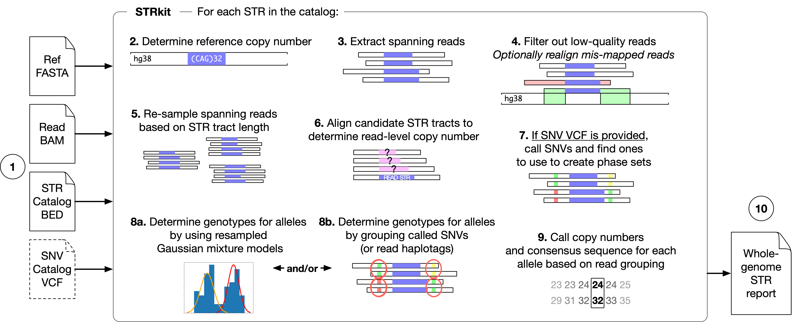
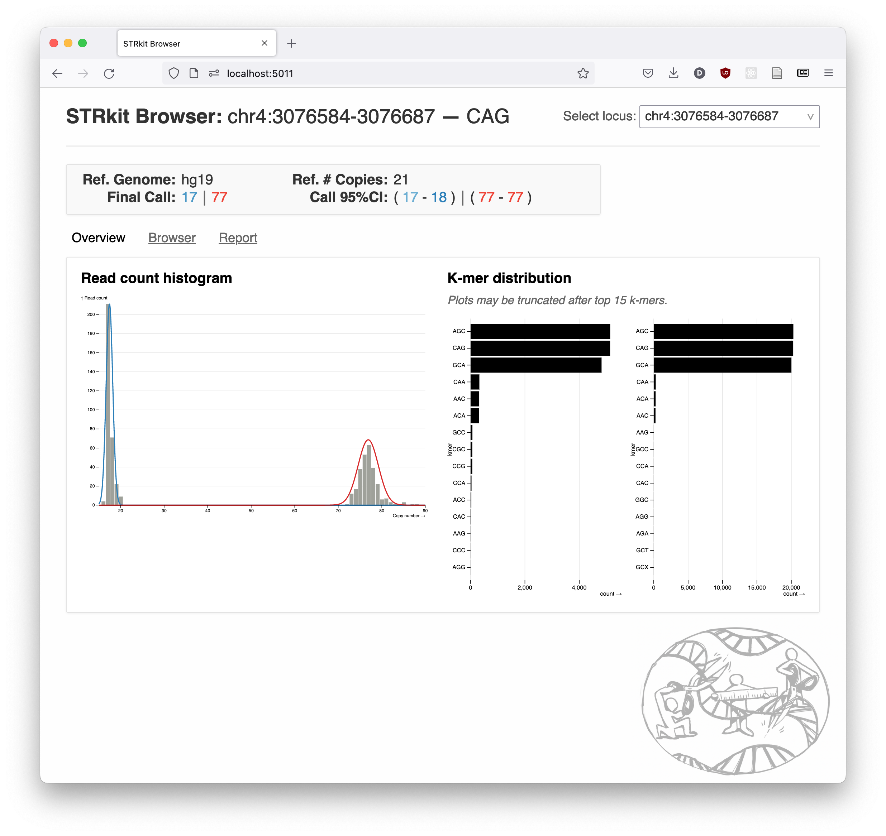
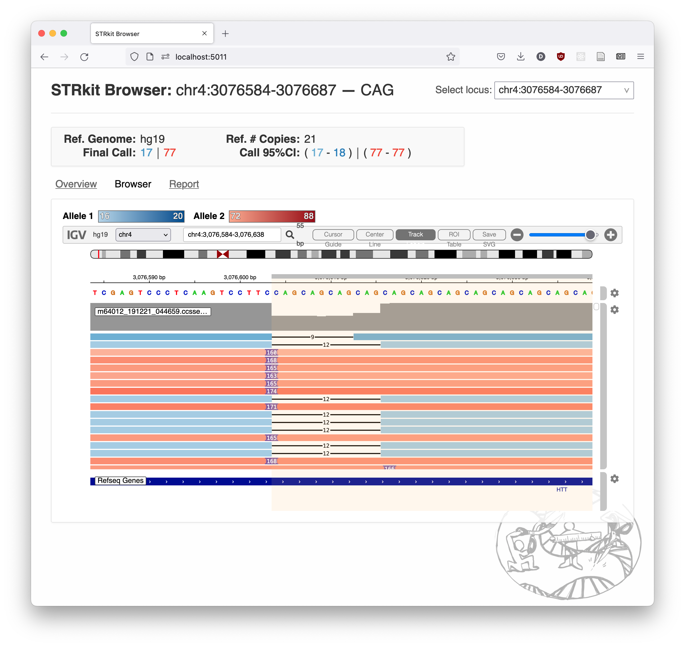

# STRkit - short tandem repeat genotyping with long reads

[](https://badge.fury.io/py/strkit)

STRkit is a short tandem repeat (STR) genotyping and analysis toolkit for long read sequencing data, especially 
PacBio HiFi data. The STRkit software package is written in Python and is available in the PyPI package registry or as
a Docker container.


## Copyright and License

* 2021-2023: &copy; David Lougheed (DL) and McGill University 2021-2023 (versions up to and including `0.8.0a1`), 
  created during graduate research by DL.
* 2023+: (versions beyond `0.8.0a1`):
  * Portions &copy; DL and McGill University 2021-2023
  * Portions &copy; McGill University 2024
  * Portions &copy; DL 2024


### Notice

This program is free software: you can redistribute it and/or modify
it under the terms of the GNU General Public License as published by
the Free Software Foundation, either version 3 of the License, or
(at your option) any later version.

This program is distributed in the hope that it will be useful,
but WITHOUT ANY WARRANTY; without even the implied warranty of
MERCHANTABILITY or FITNESS FOR A PARTICULAR PURPOSE.  See the
GNU General Public License for more details.

You should have received a copy of the GNU General Public License
along with this program.  If not, see <https://www.gnu.org/licenses/>.

### Exceptions

**Some exclusions to this license apply; specifically portions of 
[`strkit/viz/templates/browser.html`](strkit/viz/templates/browser.html) and
the STRkit logo files ([./docs/images/strkit_logo_small.png](./docs/images/strkit_logo_small.png)
and [./strkit/viz/static/logo.png](./strkit/viz/static/logo.png).)**

The STRkit logo is &copy; David Lougheed 2022, and was designed by Evelyn Lougheed. It is not licensed
under the terms of the GPL 3.0; it is instead licensed under the terms of the 
[CC BY-ND 4.0](https://creativecommons.org/licenses/by-nd/4.0/).

Portions of `viz/templates/browser.html` copyright (C) 2021-2022  Observable, Inc.
Used under the terms of the ISC license.


## Installation

### Via PyPI

STRkit requires Python 3.9+ and can be installed from PyPI via `pip` 
with the following command:

```bash
python -m pip install strkit
```

You may need to install the [Rust toolchain](https://www.rust-lang.org/tools/install)
to compile the `strkit_rust_ext` wheels, although prebuilt wheels for this module are available
for some platforms.

On Digital Research Alliance of Canada/Compute Canada clusters, this involves loading a module:

```bash
module load rust/1.76.0
python -m pip install strkit
```

STRkit should then be available in your Python environment as a command-line tool:

```bash
strkit --help
```

### As a Docker container

STRkit is also available as a [Docker container](https://github.com/davidlougheed/strkit/pkgs/container/strkit), stored 
in the GitHub Container Registry.

It can be pulled using the following command:

```bash
docker pull ghcr.io/davidlougheed/strkit:latest
```

Then, STRkit commands can be run mostly as normal using the Docker image:

```bash
docker run -it ghcr.io/davidlougheed/strkit --help
```


## Commands

### `strkit call`: Genotype caller with bootstrapped confidence intervals

A Gaussian mixture model tandem repeat genotype caller for long read data.
STRkit is tuned specifically for high-fidelity long reads, although other 
long read data should still work.



#### Features:

* Performant, vectorized (thanks to [parasail](https://github.com/jeffdaily/parasail))
  estimates of repeat counts from high-fidelity long reads and a supplied 
  catalog of TR loci and motifs.
* Re-weighting of longer reads, to compensate for their lower likelihood of observation.
  * Whole-genome and targeted genotyping modes to adjust this re-weighting.
* Incorporation of single-nucleotide variation (SNVs) for better and faster calling plus 
  additional downstream analysis possibilities.
  * Recommended for **HiFi data only**. In my testing, this worsens runtime and call quality for 
    ONT-UL data, but speeds up the tool and improves call quality for HiFi data. 
* Parallelized for faster computing on clusters and for ad-hoc fast analysis of single samples.
* 95% confidence intervals on calls via a user-configurable optional parametric bootstrapping process.


#### Usage:

```bash
strkit call \
  path/to/read/file.bam \  # [REQUIRED] One indexed read file (BAM/CRAM)
  --hq \  # If using PacBio HiFi reads, enable this to get better genotyping & more robust expansion detection
  --realign \  # If using PacBio HiFi reads, enable this to enable local realignment / read recovery. Good for detecting expansions, but slows down calling.
  --ref path/to/reference.fa.gz \  # [REQUIRED] Indexed FASTA-formatted reference genome
  --loci path/to/loci.bed \  # [REQUIRED] TRF-formatted (or 4-col, with motif as last column) sorted list of loci to genotype
  --incorporate-snvs path/to/dbsnp.vcf.gz \   # [RECOMMENDED FOR HIFI ONLY] If you want SNV calls to help phase STRs & speed up calling
  --min-reads 4 \  # Minimum number of supporting reads needed to make a call
  --min-allele-reads 2 \  # Minimum number of supporting reads needed to call a specific allele size 
  --flank-size 70 \  # Size of the flanking region to use on either side of a region to properly anchor reads
  --consensus \  # If this flag is set, consensus sequences are calculated for alleles. This increases runtime! 
  --seed 183 \  # Fixed random number generator seed for replicability
  --processes 10  # Number of parallel processes to use; DEFAULT: 1
```

Ideally, you should be using a read file aligned with parameters tuned for tandem repeats. 
PacBio provides a 
[recommended workflow](https://github.com/PacificBiosciences/apps-scripts/tree/master/RepeatAnalysisTools)
for CCS alignment in this scenario.

If you're using HiFi reads as input, **use the `--hq` and `--realign` options** to get better 
genotype calculation and a greater proportion of reads incorporated into the computed genotypes, 
respectively. These should not add much performance overhead.

If you want to **incorporate haplotagging from an alignment file (`HP` tags)** into the 
process, which should speed up runtime and potentially improve calling results, you must pass 
the `--use-hp` flag. **This flag is experimental, and has not been tested extensively.**

If you want to **incorporate SNV calling** into the process, which speeds up runtime and gives
marginally better calling results, you must provide an indexed, `bgzip`-compressed SNV catalog 
VCF which matches your reference genome. You can find dbSNP VCFs at
[`https://ftp.ncbi.nih.gov/snp/organisms/human_9606/VCF/`](https://ftp.ncbi.nih.gov/snp/organisms/human_9606/VCF/).
The file for GRCh38 is called `00-common_all.vcf.gz` as of time of writing.
**Note that this does not need to be an SNV call file for your sample, specifically**; just one 
which has positions, reference/alternate alleles, and the `ID` field populated.

If you want to output a full call report, you can use the `--json output-file.json` argument to
specify a path to output a more detailed JSON document to. This document contains 99% CIs, peak
labels, and some other information that isn't included in the normal TSV file. If you want this
file to be indented and human-readable, use the `--indent-json` flag in addition to `--json ...`.
Note that **memory usage will be higher** when JSON output is enabled.

If you want to output a VCF file (STRs and SNVs if called; currently not phased), use the
`--vcf ...` argument. If you pass `--vcf stdout`, the VCF will be written to `stdout` instead of a 
file.

See the '[Caller catalog format & choosing a catalog](./docs/caller_catalog.md)' page for more on
how to format a locus catalog or choose from existing available catalogs.

Note that the reference genome must be BGZipped and indexed using `samtools faidx`:

```bash
# Starting from a .fa:
bgzip my-reference.fa  # Replaces .fa with a .fa.gz file
samtools faidx my-reference.fa.gz  # Generates a .fai index file
```


#### Further documentation on the STRkit caller, including output format:

  * [Advanced caller usage and configuration](./docs/caller_usage.md)
  * [Caller catalog format & choosing a catalog](./docs/caller_catalog.md)
  * [Output formats](./docs/output_formats.md)


### `strkit visualize`: Call visualizer

STRkit bundles a call visualization tool which takes as input a BAM file and
a JSON call file from using the `--json` flag with `strkit call`.

It starts a web server on your local machine; the visualizations can be 
interacted with in a web browser.

To use the tool, run the following command:

```bash
strkit visualize path/to/my-alignment.bam \ 
  --ref hg38 \  # or hg19
  --json path/to/my-calls.json \
  -i 1  # 1-indexed offset in JSON file for locus of interest. Default is 1 if left out.
```

This will output something like the following:

```
 * Serving Flask app 'strkit.viz.server' (lazy loading)
 * Environment: production
   WARNING: This is a development server. Do not use it in a production deployment.
   Use a production WSGI server instead.
 * Debug mode: on
 * Running on http://localhost:5011 (Press CTRL+C to quit)
...
```

You can then go to the URL listed, `http://localhost:5011`, on your local machine
to see the visualization tool:


*STRkit browser histogram, showing an expansion in the HTT gene.*


*The same expansion, shown in the igv.js browser. Note the insertions on
the left-hand side in most reads, and the heterozygous copy number pattern.*

To exit the tool, press `Ctrl-C` in your command line window as mentioned in 
the start-up instructions.


### `strkit mi`: Mendelian inheritance analysis

Using trio data, candidate de novo STR mutations (or genotyping errors/dropout rates) can be discovered 
by looking at inheritance patterns. This tool provides a few different ways to do this, via:

* Mendelian inheritance % (MI) calculations for many common TR genotyping tools for both long/short reads, 
  including support for genotyping methods which report confidence intervals.
* Reports of loci (potentially of interest) which do not respect MI
* An optional test flag to detect de novo events and assign a p-value in trio JSON reports generated by 
  `strkit call`. Note that **this currently will over-report significance with low coverage** as tested with the 
  `x2` chi-squared test option.

**For more information on what kind of analyses can be done with this data**, see the
[Trio analyses with STRkit](./docs/trio_analyses.md) page.
